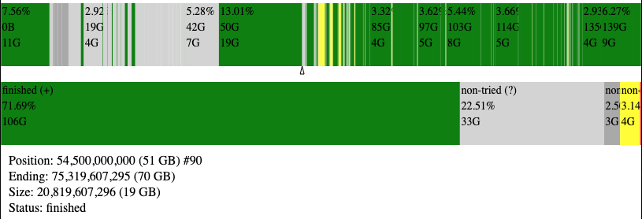

# ddrescue-to-svg
Convert a ddrescue mapfile into a human-readable SVG.

Taken from [GNU ddrescue](https://www.gnu.org/software/ddrescue/) site:
> [GNU ddrescue](https://www.gnu.org/software/ddrescue/) is a data recovery tool. It copies data from one file or block device (hard disc, cdrom, etc) to another, trying to rescue the good parts first in case of read errors.
>
> If you use the mapfile feature of ddrescue, the data are rescued very efficiently, (only the needed blocks are read). Also you can interrupt the rescue at any time and resume it later at the same point. The mapfile is an essential part of ddrescue's effectiveness. Use it unless you know what you are doing.

Being able to pause/resume/skip around in the recovery process is incredibly powerful, I think it one of the best tools for recovering data from damaged media. It works similar to [dd](https://en.wikipedia.org/wiki/Dd_%28Unix%29), but data recovery targeted, and somewhat automated. While viewing the ddrescue output and mapfile is helpful, I still wanted something more visual to get a better picture of the state of the media and recovery process. Hence, this script.

### Usage:

```
python3 ddrescue-svg.py my-map-file.txt [optional-output-filename.svg]
```

### Example output:



### Output SVG explanation:

- The first graph is your volume, first to last byte. A rectangle is drawn every time there is a state change, and large slices are labeled with additional information, being percentage of total volume, the start point and the size of the slice. If the mouse is hovered over this graph, all information about that slice is displayed at the bottom.
- A small triangle/arrow appears below the first graph, this is the current location where ddrescue is working.
- The second graph is a sum of all states in the mapfile.
- The information at the bottom appears and changes as you mouse-over the first graph.
